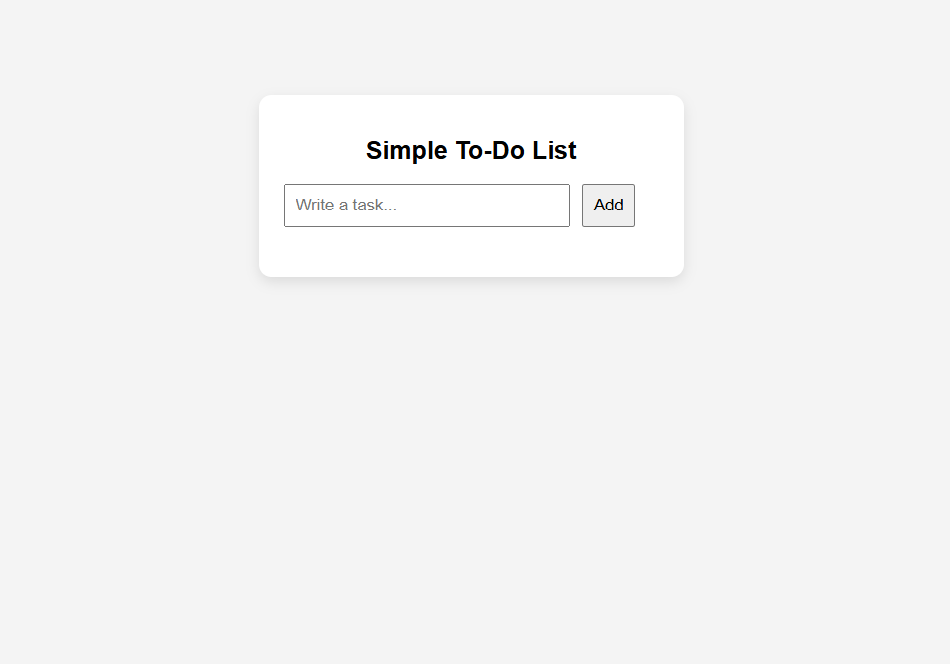
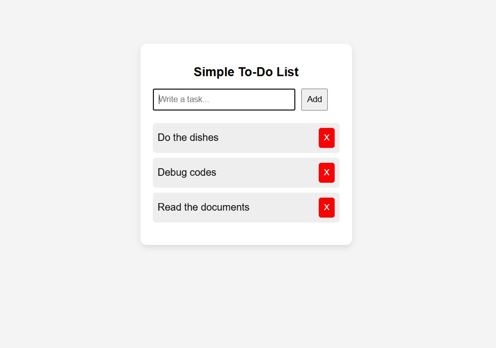

# 📝 Simple To-Do List

A simple To-Do List app built with HTML, CSS and JavaScript.

## 🚀 Features

- Add tasks
- Delete tasks
- Prevent empty tasks
- Add tasks by pressing Enter
- Clean and simple UI

## 🛠️ Technologies Used

- HTML
- CSS
- JavaScript (Vanilla JS)

## 📸 Preview

### Empty state

### With tasks

## ▶️ How to Use

1. Write a task in the input
2. Click "Add" or press Enter
3. Delete tasks with the "X" button

## 📂 Project Structure

- index.html
- style.css
- index.js

## 💡 What I Learned

- DOM manipulation
- Event handling
- Creating and removing elements
- Basic UI styling with CSS

## 📌 Future Improvements

- Mark tasks as completed
- Save tasks with localStorage
- Add filters (active/completed)

## 🌐 Live Demo

 https://alpaydevv.github.io/simple-todo-app/
